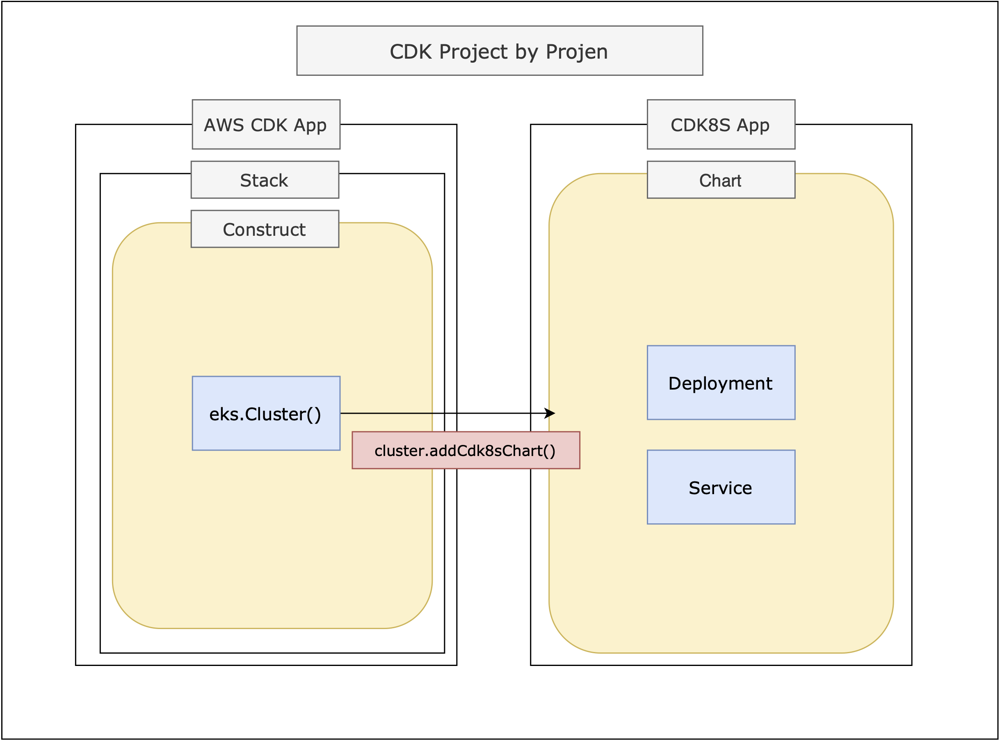

# eks-cdk8s-refarch

Reference architecture for building load-balanced web services in Amazon EKS with AWS CDK and CDK8S.

# High Level Architecture



# Deploy

```sh
# see the diff before deployment
$ cdk diff
# deploy the whole stack
$ cdk deploy 
# detroy the whole stack
$ cdk destroy
```
